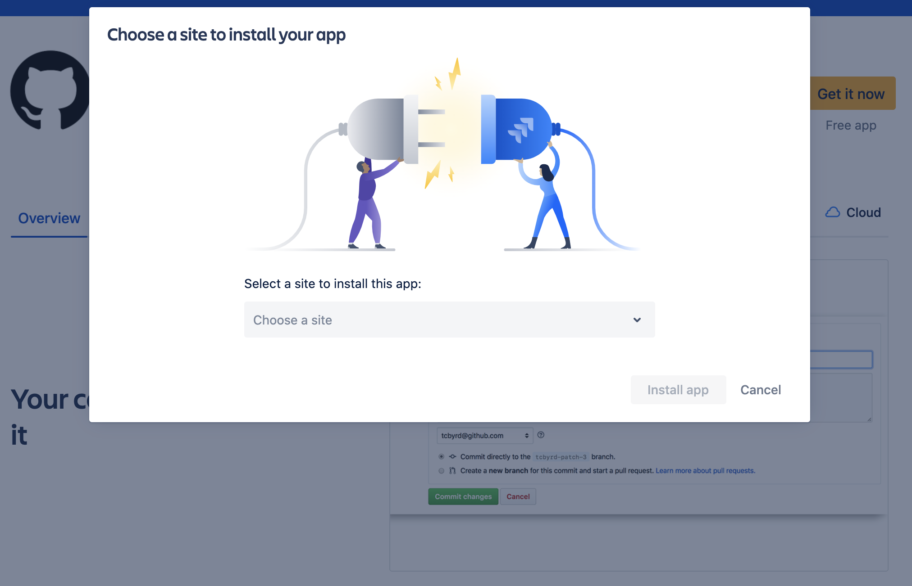
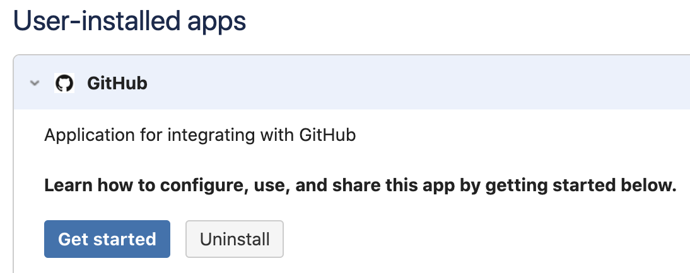
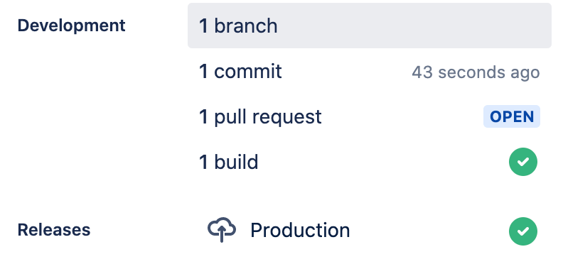

# GitHub.com + Jira Software integration

| Build |
|-------|
|  |

## About
Connect your code with your project management in Jira. A separate Jira subscription is required. With two of your most important tools connected, you'll spend less time managing projects and more time working on them. This integration is an open source project, built and maintained by GitHub (however, we're currently in the process of migrating the ownership from GitHub to Atlassian).

## Table of Contents
- [Installation and setup](#installation-and-setup)
  - [Requirements](#requirements)
  - [Installation](#installations)
  - [Connecting your GitHub Organization](#connecting-your-github-organization-to-jira)
  - [Authorization](#authorization)
- [Using the integration](#using-the-integration)
  - [Development information in Jira](#development-information-in-jira)
  - [Take action using Smart Commits](#take-action-using-smart-commits)
  - [Link issues in GitHub](#link-issues-in-github)
  - [Manage Jira Subscriptions](#manage-jira-subscriptions)
- [Migrating from the DVCS connector](#migrating-from-the-dvcs-connector)
- [Need help?](#questions-need-help)
- [Contributing](#contributing)
- [License](#license)

--------

## Installation and setup

### Requirements
This app officially supports GitHub.com and Jira Cloud. Support for integration of GitHub Enterprise Server with Jira Server, Jira Data Center and/or Jira Cloud as well as of GitHub.com with Jira Server and/or Jira Data Center may be considered in the future.

### Installations

You can install this app from the Atlassian Marketplace, from your Jira instance or from the GitHub Marketplace. The instructions are below, you can choose whichever you prefer.

### Installation from Atlassian Marketplace
1. Go to https://marketplace.atlassian.com/apps/1219592/github-for-jira?hosting=cloud
2. Click **Get it now**, choose the Jira instance you want to install your app, click **Install app** and follow the steps on screen.

3. Next you'll need to [Connect your GitHub Organization to Jira](#connecting-your-github-organization-to-jira).

### Installation from your Jira Instance
1. Sign in to your Jira Cloud account.
2. From the top menu bar in Jira, select **Apps** -> **Find new Apps**.
   - For older versions of Jira, you won't have Apps at the top menu bar. Instead, open the left sidebar by clicking on **Personal Settings**, if the left sidebar is not already open. From the left sidebar in Jira, select **Jira Settings** -> **Apps** -> **Find new Apps**. For an even older version of Jira, you won't have the left side menu. Instead, click the **Gear Icon** in the top-right corner and select **Settings**. From there, select **Manage add-ons** from the left sidebar.
3. Search for **GitHub for Jira** and Click **Get app**

7. Click the **Get Started** button to connect your GitHub account.
8. Next you'll need to [Connect your GitHub Organization to Jira](#connecting-your-github-organization-to-jira).

### Installation from GitHub Marketplace
1. Go to https://github.com/marketplace/jira-software-github
2. Complete the (free) order for your GitHub Organization
3. On the installation setting screen, choose which repositories you want to use with the Jira Integration and press **Save**:

4. Once installation completes, you will be redirected to https://jira.github.com/github/setup. Enter the site name for your Jira instance here and click **Continue**
5. Once on the Atlassian add-on page, click **Install**.
6. Once the add-on is installed, click the **Get Started** button.

### Connecting your GitHub organization to Jira
As part of the installation flow you should be directed to install the Jira app on GitHub to your organization. You can also manage existing connections or add additional organizations any time within the Manage Apps section of your Jira settings:

#### Selecting GitHub repositories
If you originally gave the app access to "All repositories", and you've created a new repository on GitHub after installing the GitHub integration for Jira, your new repository will automatically work with the integration. If you installed the app on a subset of repositories, the app will need to manually edit your repository selection by:
1. Sign in to your Jira Cloud account
2. From the top menu bar in Jira, select **Apps** -> **Manage your apps** -> **GitHub** -> **Get started**
3. Select **Configure** next to the relevant organization you want to manage.

### Authorization
By granting the app access, you are providing the following authorizations to your GitHub and Jira accounts:

#### Jira Permission Scopes
Read, Write, and Admin for Development Information (branches, commits, and pull requests)

#### GitHub Permission Scopes

|Permission scope|Why we need it|
|---|---|
|**Read** access to code & metadata | To sync development information to Jira|
|**Read** and **write** access to actions, deployments, issues and pull requests| To power Smart Commit actions and unfurl Jira URLs|

## Using the integration

### Development information in Jira
When a developer makes a commit, they should add a Jira Software issue key to the commit message, like this:
`git commit -m "PROJ-123 add a README file to the project."`

Jira Software uses the issue key to associate development data with an issue, so it can be summarized in the Development panel of the Jira Software issue.

See [Integrating with development tools](https://support.atlassian.com/jira-cloud-administration/docs/integrate-with-development-tools/) for more information.

### Take action using Smart Commits
[Smart Commits](https://confluence.atlassian.com/jirasoftwarecloud/processing-issues-with-smart-commits-788960027.html) allows you to add a comment on a Jira issue from commit messages, branches, and pull requests. For example: `[JRA-123] fix typo` will be sent through to Jira and appear in the Development Information section of the Jira issue with the key `JRA-123`.

> example

### Link issues in GitHub
If an issue body contains a valid Jira issue key on your instance, the integration will automatically expand it into a reference link when surround in brackets `[]`. For example: `[JRA-123]` will be turned into a link to `https://<your-instance>.atlassian.net/browse/JRA-123` . Markdown references are only visible when editing an Issue/PR comment, and appear at the bottom of the text area:

This makes it so Jira issues can be linked inside a comment without it interrupting the flow of the comment as a whole.

### Manage Jira Subscriptions

Admins of an installation can view and delete subscriptions to other Jira instances, without having to log in to the Jira instance itself:

This is useful if your installation is setup to send Development information to an instance you no longer have access to, or to audit instances other admins in your org may have previously configured. This only gives you the permission to delete the connection, and will not give you access to the instance itself. You will still need to be granted access in Jira if you want to be able to view the Development information that's been sent to that instance.

### Support to GitHub Actions - New!

We have just added support to GitHub Actions in Jira! You'll now be able to see your builds and deployments from GitHub Actions in the dev panel.

## Migrating from the DVCS connector
Existing users of Jira's built-in DVCS connector that meet the [requirements](#requirements) should migrate to this integration. If you've not yet been prompted to do so, you can manually kick off the migration by:
1. Sign into your Jira Cloud account
2. From the left sidebar in Jira, select Jira Settings -> Applications -> DVCS accounts.
3. Follow the prompt to upgrade your GitHub connection

## Questions? Need help?
Take a look through the [troubleshooting steps in our support guide](SUPPORT.md).

## Contributing
Want to help improve the integration between GitHub and Jira? Check out the [contributing docs](CONTRIBUTING.md) to get involved.

## License
The project is available as open source under the terms of the [MIT License](LICENSE).

When using the GitHub logos, be sure to follow the [GitHub logo guidelines](https://github.com/logos).
